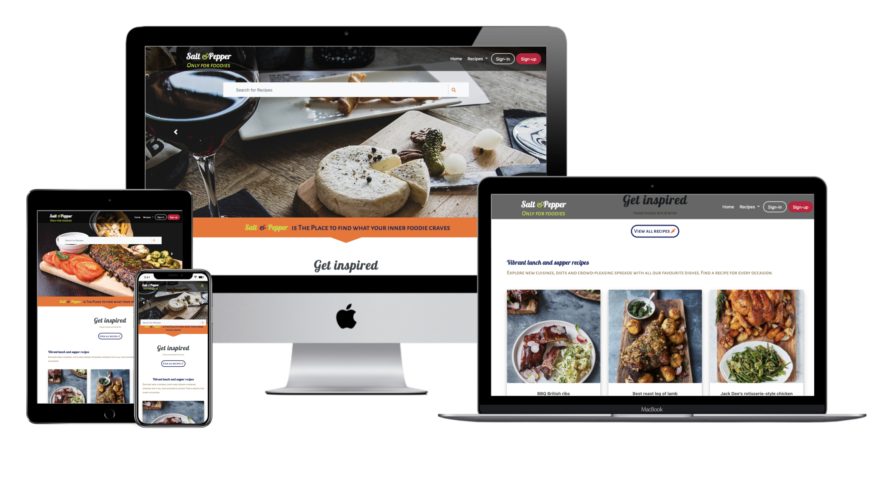
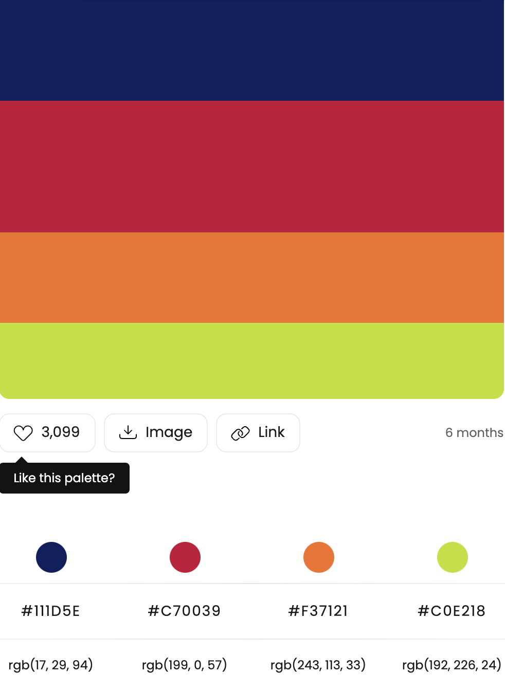
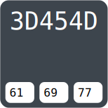
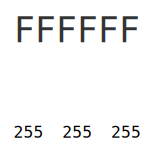
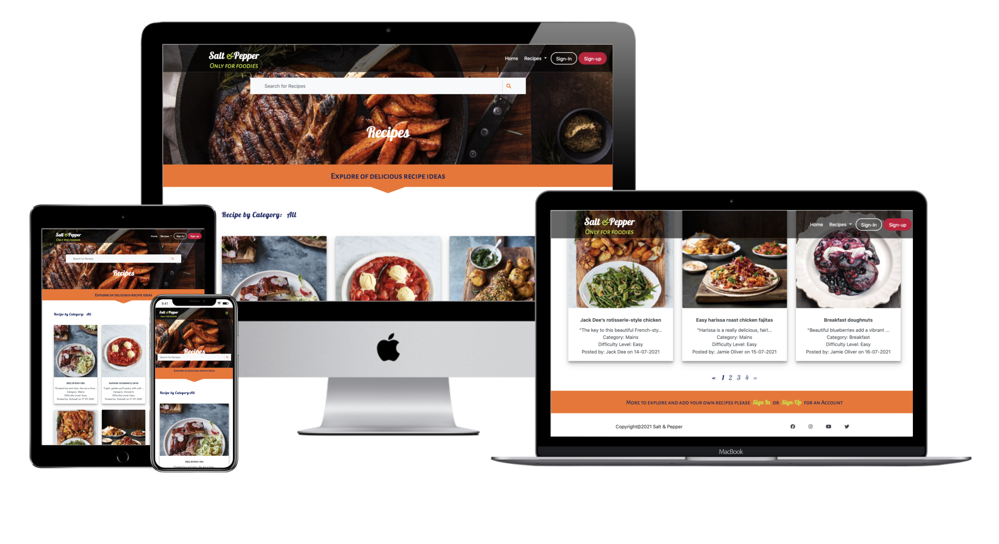
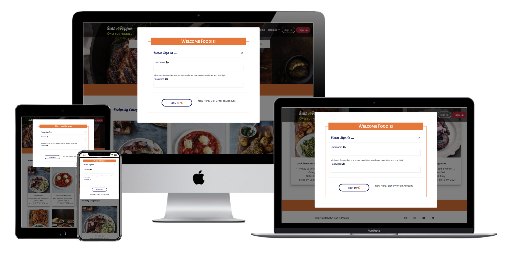
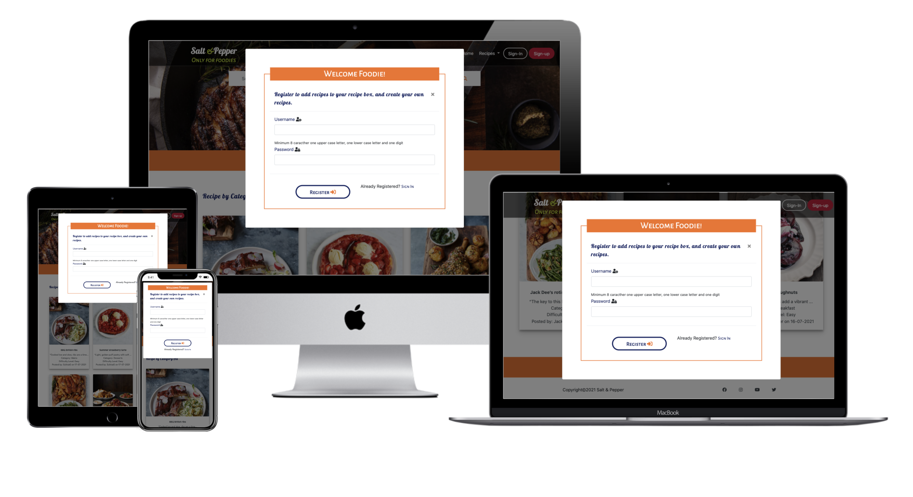
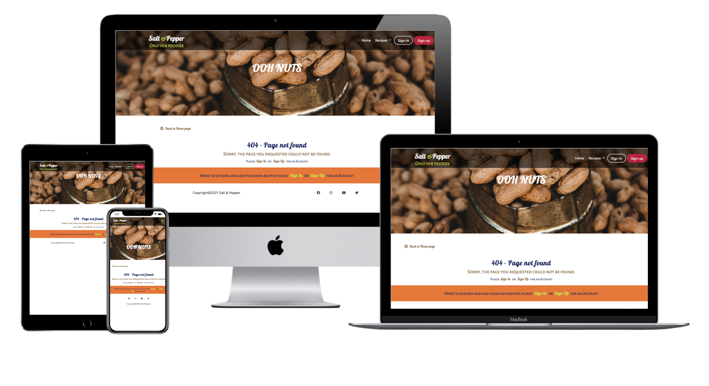
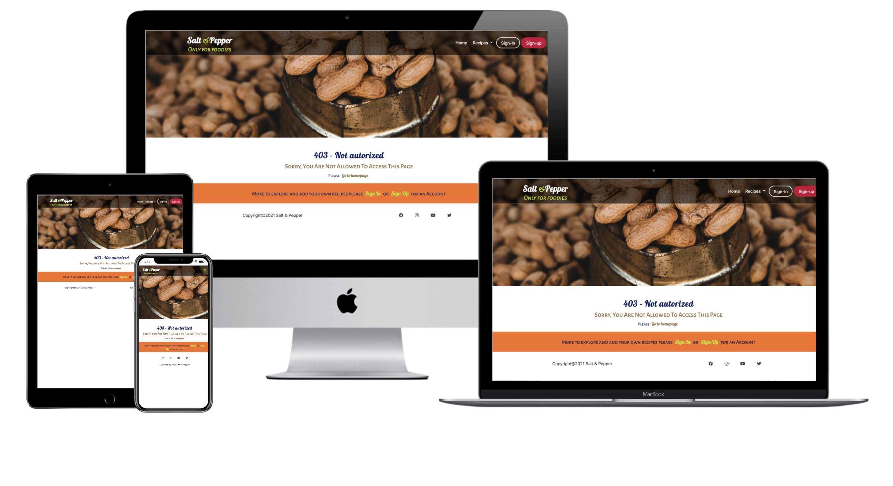
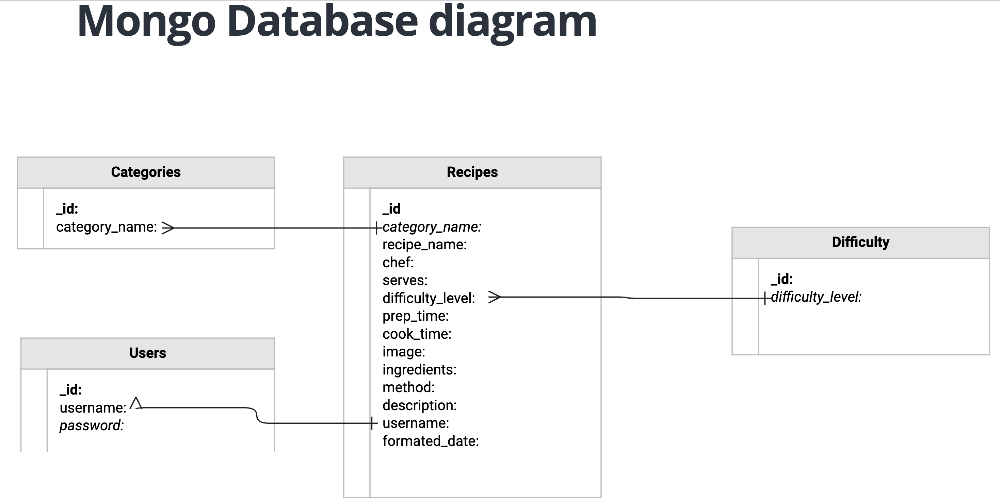

<h1 align="center">Salt and Pepper</h1>
<h1 align="center"></h1>

## About
Salt and Pepper is the website for anyone who believes that good food brings us together, no matter where are you (they) live. KEEP COOKING DAILY - these recipes show you how to make a delicious meal or incredible drinks easyly in your home. Salt and Pepper is a website for all food lovers who love to eat, try different flavour and create magnificent recipes!

I created this for **Milestone Project 3 (Python and Data-Centric Development), Full Stack Software Development** in [Code Institute](https://codeinstitute.net/), Ireland.
It is fully responsive on all devices and easy to navigate for users.
The link to the website is available [HERE](http://salt-and-pepper-project.herokuapp.com/home/).

<a href="#top">🔝</a>

## Table of Contents

[User Experience](#ux)

[Design](#design)

[Features](#features)

[Technologies](#technologies)

[Testing](#testing)

[Deployment](#deployment)

[Credits](#credits)

<a href="#top">🔝</a>

## User Experience (UX)

### User Stories
Salt and Pepper gives the information about different recipe with cooking method, cooking-time, ingredients-list posted by users.
Salt and Pepper provides to create your own account and post recipe.
- #### Generic User
    1. I want to easily understand the purpose and the layout of the site without additional instructions needed.
    1. I want to easily navigate through the site to browse the content.
    1. I want the site is responsive on all device.
    1. I want to use the navigation at all times so I can quickly navigate from one page to another.

- ####  Admin/Owner
    1. As a Admin/Owner I want to read all the recipe.
    1. As a Admin/Owner I want to add, edit and delete my recipe.
    1. As a Admin/Owner I can delete or edit others recipe from my site.
    1. As a Admin/Owner I want manage categories of recipes.I want to add, edit and delete the category.

- #### User who wants to get recipe
    1. I want to check all the recipe without sign in or sign up on site.
    1. I want to get recipe by search option.

- #### User who wants to post recipe
    1. I want to create my profile by sign up.
    1. I want to easliy login and check my page.
    1. I want to add new recipe on my page and available to all users of site.
    1. I want to edit and delete my recipe only.

<a href="#top">🔝</a>
    

## Design
### Colour 
* The main colors which is used for the website can be find [HERE](https://colorhunt.co/palette/111d5ec70039f37121c0e218).
    
    
    
    The grey, and white color is used for text-color and background-color.

     
     

### Typography

* The font used is a Alegreya Sans SC with sans-serif as a fallback font.
* The logo font used is a Pattaya for brand name and Alegreya Sans SC for brand slogen.

### Icons

* The icons have functional purposes such as the hamburger menu and social media icons and provided by [Font Awesome](https://fontawesome.com/). 

### Defensive Design

* The user is not able to break the site by clicking on buttons.
* The add and edit recipe form:
    - The category has to be chosen.
    - The Difficulty Level has to be chosen.
    - The image URL must start with https://.
* Recipes or categories can't be deleted by just one click. 
    - If someone clicks on the delete button, there will be a modal with a confirmation
        if someone is sure to delete the recipe or category.

### Mockups

- #### [Mockup made through original website](https://techsini.com/multi-mockup/index.php) 

    
    
    
    
    
    

- #### Wireframe information can be found in the separate [Wireframes](https://github.com/szilG/Salt-and-Papper/tree/master/wireframes) file.   
    

<a href="#top">🔝</a>

## Features
### Existing Features
* On each page header allows user to easily navigate across all pages
  - The header is positioned to always be visible (positioned absolutely using Bootstrap 'fixed-top' class) at the top of the screen (mobile and desktop) which allows visitors to find it quickly.
  - The brand logo is positioned on the left and is visible on all pages and by clicking the logo returns users to the home page.
  - Navigation links is more visible when hovered over. This lets the visitor know that it is clickable.
  - Navigation links collapse when viewed on mobile device.
* Flash messages
  - Messages displayed at the top of the page to provide the user confirmation of actions like sing-in, adding or editing recipe etc.
* Responsiveness
  - All Pages are responsive on different viewport size.
* Footer
  - There are social links and when hovered over, it changed the color.
  - There is a Business copyright information.

**Home page Features**
  - This page has header, footer and search box. 
On the page three subcategory, each subcategory has a clickable links that takes the user the selected category page.
Eeach subcategory has three recipe cards with recipe name, short description, difficulty level, who is the chef, the posted date and the recipe image.
Each cards is clickable and takes the user to the selected recipe page.
If the card has no recipe image custom image will appear.
The header has navigation bar and footer has copyright and social links.
The image brings the user's attention and inviting the user to explore the website.

**Recipes page Features**
  - This page has header, footer and search box.
This page has list of all recipes with recipe name, short description, difficulty level, who is the chef, the posted date and the recipe image.
Each cards is clickable and takes the user to the selected recipe page.
The user can change the category by clicking the navbar recipes dropdown menu and choose the different category
The image brings the user's attention and inviting the user to explore the website.

**Profile page Features**
  - This page contains all of the user recipes.
This page has header, footer.
There is an Add recipe button that takes the user to the new recipe page where user can add new recipes.
There is an Edit and Delete button by clicking on it user can edit or delete there own recipes.

**New recipes page Features**
  - This page contains a recipe form for the user to fill out and upon submission will go into the database and show on the users profile page.
At the bottom of the form there are the add recipe and Cancel buttons. 

**Manage Category page Features**
  - Only admin can access this page. In this page admin can manage categories
Add, Edit and Delete categories.

**Recipes Description (Single_recipe.html) page Features**
  - This page displays recipe description of selected recipe.

**Sign-In Modal Features**
  - This modal has login form. After login user will reach on his page.

**Sing-Up Modal Features**
  - This modal has sign up form. After sign up a profile page created where users can add recipe.

### Features Left To Implement
* Resetting Password When Users Forget It

* Upload Image For Each Recipe:
  - Image data cannot be stored in MongoDB so this is not possible with the current project however, having image for recipes is achieved by using image URL

* Review By Other Users:
  - A page where people can leave review and comments.

* “Like” or "Rate" By Other Users/Owners:
  - Create a way for the user to rate and/or like the recipes without loggin in or register.

<a href="#top">🔝</a>

## Technologies Used
- [HTML5](https://en.wikipedia.org/wiki/HTML) for markup
- [CSS3](https://en.wikipedia.org/wiki/CSS) for style
- [Bootstrap 4.6](https://getbootstrap.com/) for the mainframe of the website
- [Python3](https://www.python.org/) as a backend programming language
- [Flask](https://flask.palletsprojects.com/) &#40;a micro web framework written in Python&#41; as the main framework of Python
- [MongoDB Atlas](https://www.mongodb.com/cloud/atlas/) as database
- [Google Fonts](https://fonts.google.com/) for fonts
- [Font Awesome](https://fontawesome.com/) for icons
- [Gitpod](https://www.gitpod.io/) as Integrated Development Environment &#40;IDE&#41;
- [Git](https://git-scm.com/) for local version control, keeping the files & documents
- [GitHub](https://github.com/) for online version control and keeping the files & documents
- [Heroku](https://www.heroku.com/) for deploying the website
- [Balsamiq](https://balsamiq.com/) Balsamiq was used to create the [wireframes](https://github.com/szilG/Salt-and-Papper/tree/master/wireframes) during the design process.

- [MongoDB](https://www.mongodb.com/) - MongoDB is cloud database service used for the project.
The project has four collections in the database. All fields are string data type.The database structure in MongoDB is as follows:

  

<a href="#top">🔝</a>

## Testing
* Testing report is available **[TESTING.md](https://github.com/szilG/Salt-and-Papper/blob/master/TESTING.md)**

<a href="#top">🔝</a>

## Deployment

- ### Working with the local copy
  1. Install all the requirements: Go to the workspace of your local copy. In the terminal window of your IDE type: pip3 install -r requirements.txt.
  2. Create a database in MongoDB
     - Signup or login to your MongoDB account.
     - Create a cluster and a database.
     - Create four collections in the db: categories, recipes, difficulty, users.
     - Add string values for the collections.
  3. Create the environment variables
     - Create a .gitignore file in the root directory of the project.
     - Add the env.py file in the .gitignore.
     - Create the file env.py. This will contain all the envornment variables.
        - Import os
        - os.environ.setdefault("IP", "Your IP")
        - os.environ.setdefault("PORT", "Yout Port")
        - os.environ.setdefault("SECRET_KEY", "Your Secret_key")
        - os.environ.setdefault("MONGO_URI", "Your mongo_uri")
        - os.environ.setdefault("MONGO_DBNAME", "Your database name")
  4. Run the app: Open your terminal window in your IDE. Type python3 app.py and run the app.

- ### Heroku Deployment
  1. Set up local workspace for Heroku
     - In terminal window of your IDE type: pip3 freeze -- local > requirements.txt. (The file is needed for Heroku to know which filed to install.)
     - In termial window of your IDE create a file called Procfile: "echo web: python app.py > Procfile". (The file is needed for Heroku to know which file is needed as entry point.)
  2. Set up Heroku: create a Heroku account and create a new app and select your region.
  3. Deployment method 'Github'
     - Click on the Connect to GitHub section in the deploy tab in Heroku.
       - Search your repository to connect with it.
       - When your repository appears click on connect to connect your repository with the Heroku.
     - Go to the settings app in Heroku and go to Config Vars. Click on Reveal Config Vars.
       - Enter the variables contained in your env.py file. it is about: IP, PORT, SECRET_KEY, MONGO_URI, MONGO_DBNAME
  4. Back within the terminal Push the requirements.txt and Procfile to repository.
     - $ git add requirements.txt
     - $ git commit -m "Add requirements.txt"
     - $ git add Procfile 
     - $ git commit -m "Add Procfile"
     - $ git push
  5. Automatic deployment: Go to the deploy tab in Heroku and scroll down to Aotmatic deployments. Click on Enable Automatic Deploys. By Manual deploy click on Deploy Branch.

  Heroku will receive the code from Github and host the app using the required packages. Click "View" to launch your new app. The app will open and the live link is available from the address bar. 

- ### Forking
  If you wish to contribute to this website you can Fork it without affecting the main branch by following the procedure outlined below.
  1. Go to the [GitHub](https://github.com/) website and log in.
  2. Locate the [Repository](https://github.com/szilG/Salt-and-Papper) used for this project.
  3. On the right-hand side of the Repository name, you'll see the 'Fork' button. It's located next to the 'Star' and 'Watch' buttons.
  4. This will create a copy in your personal repository.
  5. Once you're finished making changes you can locate the 'New Pull Request' button just above the file listing in the original repository.

- ### Cloning 
  If you wish to clone or download this repository to your local device you can follow the procedure outlined below.
  1. Go to the [GitHub](https://github.com/) website and log in.
  2. Locate the [Repository](https://github.com/szilG/Salt-and-Papper) used for this project.
  3. Under the Repository name locate 'Code' button. Click on it and a pop-up window will appear.
  4. To clone the repository using HTTPS click the copy button next to HTTPS".
  5. Open your Terminal and go to a directory where you want the cloned directory to be copied in.
  6. Type `Git Clone` and paste the URL you copied from the GitHub.
  7. To create your local clone press `Enter`

<a href="#top">🔝</a>

## Credits
#### Code
* Bootstrap library was used to create a responsive design.
[Ed Bradley](https://github.com/Edb83/self-isolution/blob/master/app.py) for pagination

#### Content
* The recipes and the Image URL-s of the page was copied from [Jamie Oliver](https://www.jamieoliver.com/)

- To write up a README file the most helpful documents were
    - Code Institute [SampleREADME](https://github.com/Code-Institute-Solutions/SampleREADME)
    - Code Institute [README Template](https://github.com/Code-Institute-Solutions/readme-template)
    - [Markdown Cheatsheet](https://github.com/adam-p/markdown-here/wiki/Markdown-Cheatsheet#code)

#### Media
###### No recipe Image
* The [No Recipe Image](https://norecipes.com/karaage-recipe/) was used from this website.
###### Carousel and Header Images  
* The carousel and header images found on [UNSPLASH.com](https://unsplash.com/)
###### Icons
* The Icons used from [Font Awesome](https://fontawesome.com/)
###### Favicon
* The [emoji graphics](https://github.com/twitter/twemoji/blob/master/assets/svg/1f374.svg) are from the open source project [Twemoji](https://twemoji.twitter.com/). The graphics are copyright 2020 Twitter, Inc and other contributors. The graphics are licensed under [CC-BY 4.0](https://creativecommons.org/licenses/by/4.0/).
###### Fonts
The project used [Google fonts](https://fonts.google.com/)

#### Acknowledgements
* Many Thanks to my mentor Akshat Garg who was brilliant and helping me throughout the project and giving me important suggestions and feedback of my work.
* Thanks to my fellow student and tutors on slack channel who helped me in some way.

#### Disclaimer
This project was made as my 3st. Milestone Project in [Code Institute](https://codeinstitute.net/5-day-coding-challenge/?utm_term=%2Bcode%20%2Binstitute&utm_campaign=a%26c_BR_IRL_Code_Institute&utm_source=adwords&utm_medium=ppc&hsa_net=adwords&hsa_tgt=kwd-319867642491&hsa_ad=326751276603&hsa_acc=8983321581&hsa_grp=56427889178&hsa_mt=b&hsa_cam=1378516521&hsa_kw=%2Bcode%20%2Binstitute&hsa_ver=3&hsa_src=g&gclid=EAIaIQobChMIiJjgxOrD7QIVz8LtCh3OQQgLEAAYASAAEgLd4vD_BwE&gclsrc=aw.ds)

<a href="#top">🔝</a>

