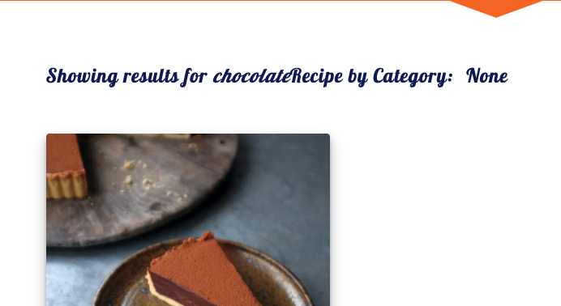
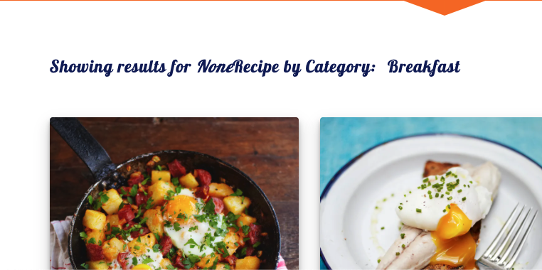
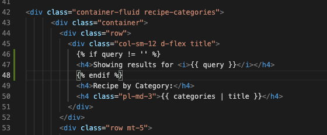
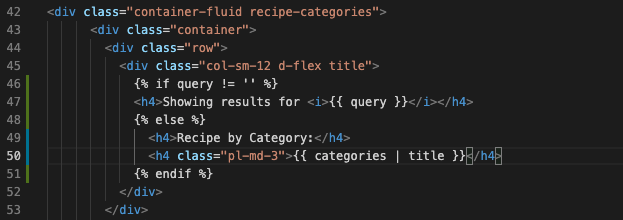

## Testing

### Functionality Testing
  - #### Navigation bar
     - The navigation bar stays at the top of the page on all screen sizes.
            - When the nav links clicks it opens the relevent page in same window with same header footer.
            - When recipes dropdown nav link clicks choose recipe categories.
            - When the Logo clicks it goes to the Home page.
            - When Sing-In or Sing-Up nav links clicks modals can pop up to aks user credentials.
  - #### Footer
     - Footer is located at the bottom of the page.
     - When the social links are clicked, they open the relevant social media page in a new tab.
  
  - All external links is tested to make sure they open up the correct pages in new tabs.
  - All internal links is tested to make sure that all pages are correctly connected.

**Form Validation**

All the forms used on the website is validated by HTML. A manual test is carried out to see if those forms are validated properly.

**Register**

- For password, Minimum 8 characters maximum 20 characters one uppercase letter, one lowercase letter and one digit so a warning message pops up for an invalid length.
- If the user already exists in the system, then an error message pops up saying **Username already exists** and it will not process the registration

**Login**

- Username and password must match to log in. 
- If one of them or both are incorrect, an error message pops up saying **Incorrect Username and/or Password. Please try Again**. Not saying what is incorrec is important because this is to make more difficult for brute-forcing an account.

    
### CCS3 validator
Validate by [CSS Validator](https://jigsaw.w3.org/css-validator/)
  - Test result : No Error

### HTML5 validator
Vaidate by [HTML5 Validator](https://validator.w3.org/#validate_by_input)
  - Test result : On all pages there are some error as I used jinja template to create the pages.

### Python Validator
Validate by direct input
    [Pyhton Validator](http://pep8online.com/)
  - Test result : Pass

### Usability Testing
  - This is shared with friends to check on different device and accessbility.

### Compatibility Testing
  - #### Browser Compatibility
    - Tested on Chrome, Firefox, Safari.
  - #### OS Compatibility
    - Tested on iOS , Android.

---

### Testing User Stories 
- #### Generic User
    - The page is simple and clear with a search box and list of recipe. 
    - All pages of website has navigation bar and footer. 
    - With navigation bar I can easily access diiferent page and go anywhere from present page and come back.
    - Footer has social links. If I click on link it open the relevant page on different tab so I can easily check the social activity.
    - I want to access external links and be able to learn more about each page.
        - Home Page
            - Home page provides the search box to search the specific recipe (type any recipe name or ingrediens) and 3 recipes of 3 categories.
        - SignIn Modal
            -  In this I can login to the website and open my profile page.
        - SignUp Modal
            - In this I can create my account by filling the form and be able to post recipe.
        - Profile Page
            - In this page I can see all my recipes. I can also add, edit and delete my recipe.
        - Recipes Page
            - In this page I can see all of the recipes.
        - Single Recipe Page   
            - In this page I can see the description of recipe with image.
        - Manage Category Page
            - This page can be accessed by only admin. In this page admin can manage category.

- #### Admin/Owner 
    - I get all recipe list posted by me and others also.
    - I can add new recipe on my page.
    - I can edit and delete my recipe anytime.
    - I can delete others recipe from my website.
    - I can add new category.
    - I can edit and delete existing categories.

- #### User who wants to get recipe 
    - I get the list of all recipe.
    - I get the specific recipe by clickink on the recipe card.
    - I get the specific recipe by search option.
    - I can also create my account on website by login form.

- #### User who wants to post recipe
    - I can easily post recipe on my page after login.
    - I can edit and delete my recipe from website anytime.
    - I can see all recipe of website but can not edit and delete others recipe.
    - I can not manage category. Only admin can manage category.

---

### Defensive Design

There are some pages on the website that users without permission are not allowed to access. Those users who have no permission from accessing these pages(i.e Add New recipe page can be accessed from Profile page or navigation bar where only users who log in have access to it), however, by typing URL, non-authorised users can try to access these pages so there are some defensive programmes set up to prevent this from happening.

Tests and results to check to see if the defensive programmes work properly.

**Not Logged in users**  

- try to access *Profile* `profile/?username=username` this led to *Error 404*. Then on the page they can go to *Sign-Up* *Sign-In Modal or go to Home page.
- try to access *Add Recipe* `add_recipe` this led to *Error 404*. Then on the page they can go to *Sign-Up* *Sign-In Modal or go to Home page.
- try to access *Edit Recipe* `edit_recipe/<object id>` this led to *Error 404*. Then on the page they can go to *Sign-Up* *Sign-In Modal or go to Home page.
- try to access *Delete Recipe* `delete/<object id>` this led to *Error 404*. Then on the page they can go to *Sign-Up* *Sign-In Modal or go to Home page.

- try to access *Manage Category `get_categories` this led to *Error 403 Not autorized*. Then on the page they can go to *Sign-Up* *Sign-In Modal or go to Home page.
- try to access *Add Category `add_category` this led to *Error 403 Not autorized*. Then on the page they can go to *Sign-Up* *Sign-In Modal or go to Home page.
- try to access *Edit Category `edit_category/<object id>` this led to *Error 403 Not autorized*. Then on the page they can go to *Sign-Up* *Sign-In Modal or go to Home page.
- try to access *Delete Category `delete_category/<object id>` this led to *Error 403 Not autorized*. Then on the page they can go to *Sign-Up* *Sign-In Modal or go to Home page.

**Logged in users**

- try to access to someone else recipes with `edit_recipe/<object id>` this led to *Profile* page with "Access denied. This is not your recipe" message
- try to access to someone else recipes with `delete_recipe/<object id>` this led to *Profile* page with "Access denied. This is not your recipe" message

**Logged in user who is Not the Admin User**

- try to access to `get_categories` this led to *Error 403 Not autorized*. Then they can go to Home page or they can use the navigation bar.
- try to access to `add_category` this led to *Error 403 Not autorized*. Then they can go to Home page or they can use the navigation bar.
- try to access to `edit_category/<object id>` this led to *Error 403 Not autorized*. Then they can go to Home page or they can use the navigation bar.
- try to access to `delete_category/<object id>` this led to *Error 403 Not autorized*. Then they can go to Home page or they can use the navigation bar.

## Known Bugs
- On the `recipes.html` page there is no message shown for how many results are found from using the search bar or which category the user selected from the navbar dropdown list.
Did not know how to achieve this with my current skill and do not have time to learn so I decided to leave this out.

  - Search results
      

  - Resuls from navbar dropdown -Breakfast-
      

  - Code 
      
      
      
- Customise Pagination: I do not know how to customise pagination (e.g. When there are more recipes, it will show page 1, 2, 3, 4, 5, 6, 7...); and do not have time to look into details so decide to leave as it is.